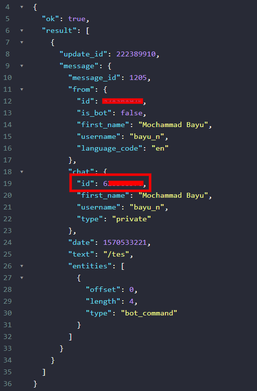

# OshiStories
Telegram bot to download your idol's latest media stories and posts

### Requirements
* [Python 3](https://www.python.org/)
* [Redis](https://redis.io)
* [Docker](https://docker.com)

### Settings before run
1. rename .env.example to .env
2. Add instagram username to OSHI_USERNAME with comma separated

### How To Create & Get BOT Token
[BotFather](https://www.siteguarding.com/en/how-to-get-telegram-bot-api-token)

### How To Get CHAT ID
1. Add bot as your friend & start chat
2. Open 
```
https://api.telegram.org/bot<YOUR_BOT_TOKEN>/getUpdates
```


### How to Dockerize
- #### Run Redis
```bash
$ docker run -it -d -p 6379:6379 redis
```

- #### Build Images
```bash
$ docker build -t muhbayu/oshi-stories .
```

- #### Run Container
```bash
$ docker run -it --rm --name oshi-stories -d muhbayu/oshi-stories
```